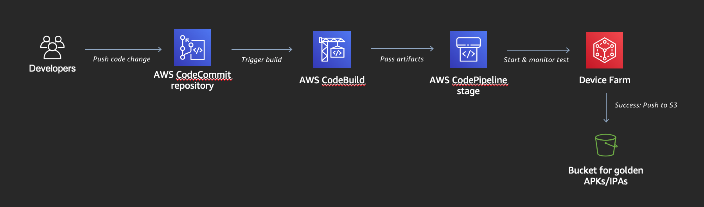

# aws-codepipeline-devicefarm

Welcome to the aws-codepipeline-devicefarm project.

This project shows you how to AWS Device Farm, AWS CodePipeline, and AWS Code Build. The integration enables developers to build automated UX testing into their mobile development workflow.

## Architecture



## Project structure

- **app/** - contains a sample Android application source code we will use for testing
- **appium/** - contains or Appium UX tests
- **cfn/** - contains a CloudFormation stack representing the resources involved
- **docs/** - contains markdown for documentation
- **images/** - contains images for documentation

## Required Software

Please install the following software in your local workstation before proceeding:

- [Git client](https://git-scm.com/downloads)

- [AWS Command Line Interface](http://docs.aws.amazon.com/cli/latest/userguide/installing.html) (version 1.11.170 or greater)

- Configure your AWS credentials (access keys, AWS region, etc). At a minimum your credentials should allow you to create and manipulate resources associated withe the following AWS services: Amazon S3, AWS CodeCommit, AWS CodePipeline, AWS CodeBuild, AWS Lambda, AWS Device Farm, and AWS IAM.

```bash
aws configure
```

## Instructions

1. [Setup your local environment and download artifacts](docs/setup.md)
2. [Create a Device Farm project](docs/device-farm.md)
3. [Create and launch a test run in the AWS console](docs/device-farm-console.md)
3. [Deploy a CI/CD pipeline with Jenkins](cicd-jenkins.md)

### Clean Up

1. Delete your AWS CloudFormation Stack
2. Delete your AWS Device Farm project
