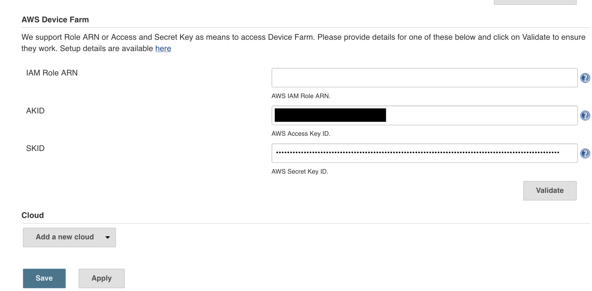
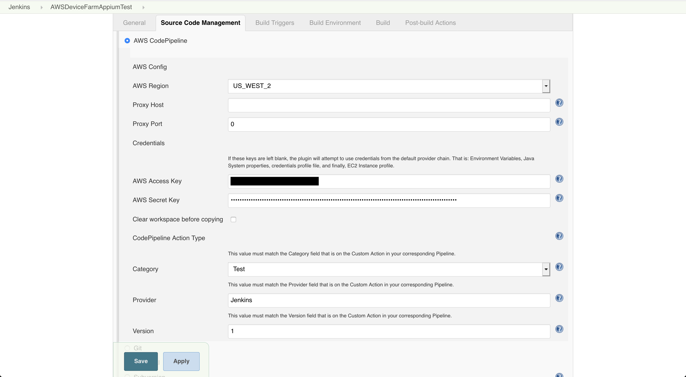

[Back to main guide](../README.md) 

[Previous: Create and launch a test run in the AWS console](device-farm-console.md)

#### Deploy a CI/CD pipeline with Jenkins

1. Deploy the CloudFormation stack (~5 minutes)
  - <a href="https://us-west-2.console.aws.amazon.com/cloudformation/home?region=us-west-2#/stacks/create/review?templateURL=https://reinvent2019-mob313.s3-us-west-2.amazonaws.com/template.yml&stackName=MOB-313" target="_blank">Launch Stack</a>
  - Check the `I acknowledge that AWS CloudFormation might create IAM resources.` box
  - Click **Create Stack**

2. Create a user for Jenkins to access Device Farm and Code Suite services

```bash
export AWS_DEFAULT_REGION=us-west-2
aws iam create-user --user-name jenkins-device-farm-access
aws iam attach-user-policy --policy-arn arn:aws:iam::aws:policy/AWSCodePipelineCustomActionAccess  --user-name jenkins-device-farm-access
aws iam attach-user-policy --policy-arn arn:aws:iam::aws:policy/AWSDeviceFarmFullAccess --user-name jenkins-device-farm-access
aws iam create-access-key --user-name jenkins-device-farm-access > creds.json; cat creds.json
```

3. Open the CodePipeline [console page](https://us-west-2.console.aws.amazon.com/codesuite/codepipeline/pipelines?region=us-west-2) and observe the stages/actions.

4. Open the CloudFormation [console page](https://us-west-2.console.aws.amazon.com/cloudformation/home?region=us-west-2#/stacks?filteringText=&filteringStatus=active&viewNested=true&hideStacks=false) to find the address of the Jenkins service
  - Click on the **MOB-313** stack
  - Cick on **Outputs** to find the Jenkins URL

5. Log into Jenkins using the URL from above
  - Click **log in** at the top right
  - For **Username**, specify `admin`
  - For **Password**, specify `admin`

6. Update Jenkins config
  - On the left menu click **Manage Jenkins**
  - Scroll down and click **Configure System**
  - Scroll down to the **AWS Device Farm** config at the bottom
  - For **AKID**, specify the AccessKeyId you generated and saved in creds.json earlier
  - For **SKID**, specify the SecretAccessKey you generated and saved in creds.json earlier
  - Click **Validate**
  - Click **Save**



7. Update Job config
  - Click the **Jenkins** menu at the top left to return to the home page
  - Click the **AWSDeviceFarmAppiumTest** job in the right pane
  - Click **Configure** in the left menu
  - Scroll down to the **Source Code Management** section
  - For **AWS Access Key**, specify the AccessKeyId you generated and saved in creds.json earlier
  - For **AWS Secret Key**, specify the SecretAccessKey you generated and saved in creds.json earlier
  - Click **Save**

  

8. Open the CodePipeline [console page](https://us-west-2.console.aws.amazon.com/codesuite/codepipeline/pipelines?region=us-west-2)
  - Click on the failed pipeline job
  - Click **Release change**
  - Click **Release**

9. Watch logs in Jenkins and observe the tests running in AWS Device Farm

10. Once job is complete review Job overview and Jenkins dashboard

[Previous: Create and launch a test run in the AWS console](device-farm-console.md)