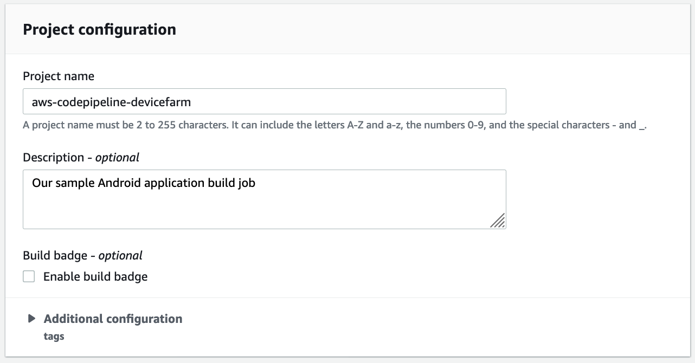
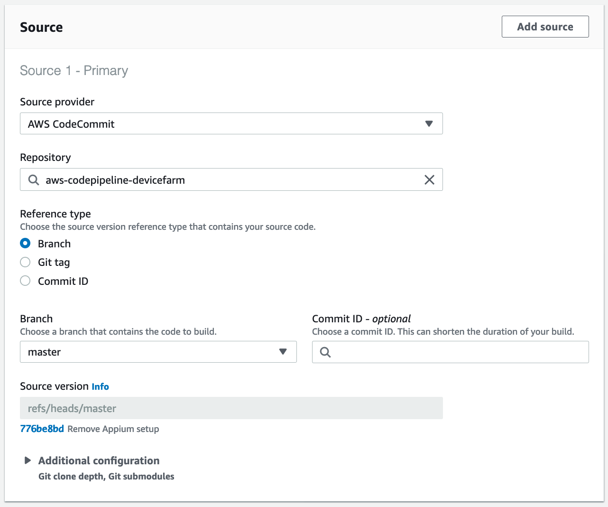
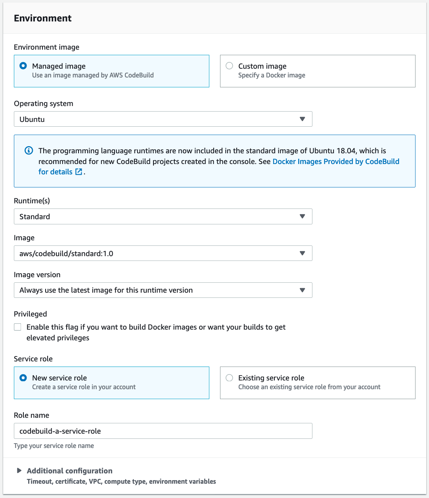
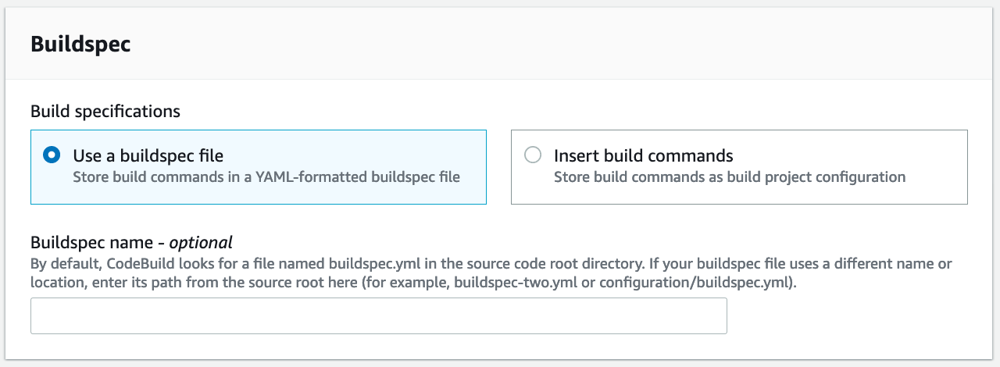
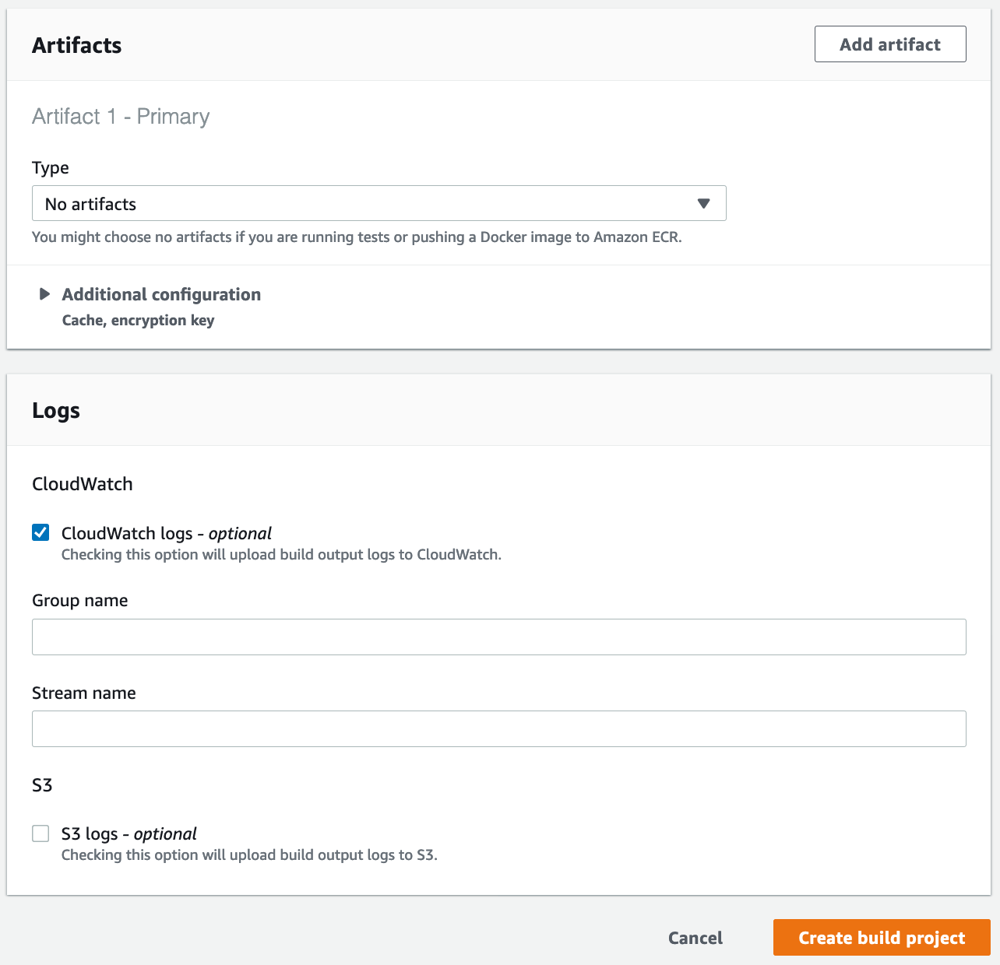

[Back to main guide](../README.md) 

[Previous](code-commit.md) | [Next](code-pipeline.md)

#### Create a CodeBuild job to build our APK and test bundle

1. Open the CodeBuild [console page](https://us-west-2.console.aws.amazon.com/codesuite/codebuild/projects?region=us-west-2)
2. Click **Create build project**
3. Under **Project configuration**:
  - For **Project name**, specify `aws-codepipeline-devicefarm`
  - For **Description**, specify `Our sample Android application build job`

4. Under **Source**:
  - For **Source provider**, choose `AWS CodeCommit`
  - For **Repository**, choose `aws-codepipeline-devicefarm`
  - For **Reference type**, choose `Branch`
  - For **Branch**, choose `master`

5. Under **Environment**:
  - Environment image: Managed image
  - Operating system: Ubuntu
  - Runtime(s): Standard
  - Service role: New service role
  - Role name: codebuild-aws-codepipeline-devicefarm-service-role

6. Under **Buildspec**:
  - Build specifications: Use a buildspec file

7. Under **Artifacts** and **Logs** accept the defaults

8. Click **Create**

[Previous](code-commit.md) | [Next](code-pipeline.md)