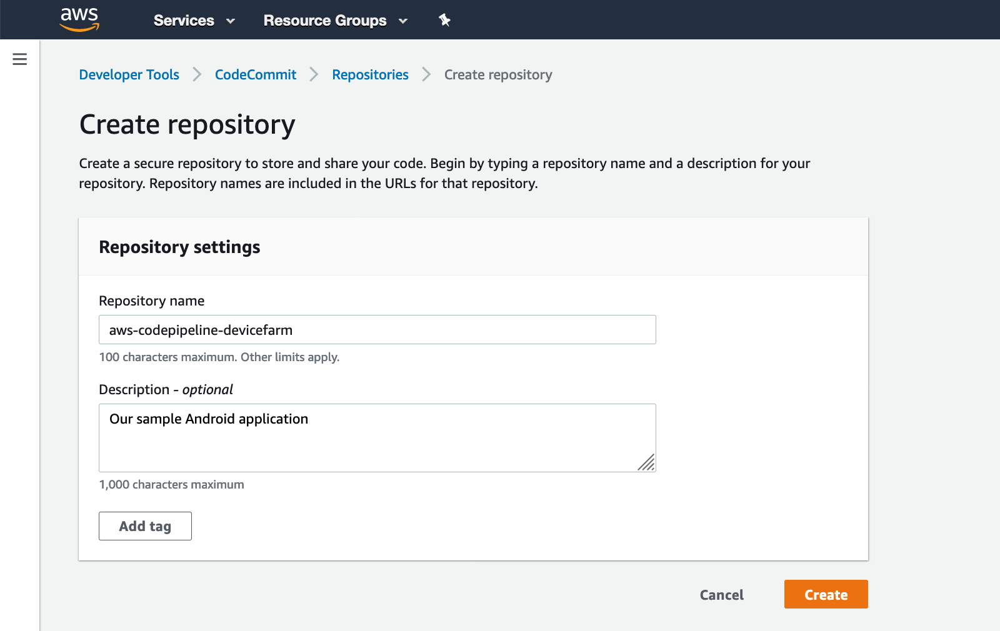

[Back to main guide](../README.md) 

[Next](code-build.md)

#### Setup an AWS CodeCommit repository

1. Open the AWS CodeCommit [console page](https://us-west-2.console.aws.amazon.com/codesuite/codecommit/repositories?region=us-west-2)
2. Click **Create Repository**
  - For **Repository name**, specify `aws-codepipeline-devicefarm`
  - For **Description**, specify `Our sample Android application`
3. Click **Create**



4. Setup the AWS credential helper for Git following the [documentation](https://docs.aws.amazon.com/codecommit/latest/userguide/setting-up-https-unixes.html#setting-up-https-unixes-credential-helper)

5. Set your region to `us-west-2`

```bash
export AWS_DEFAULT_REGION=us-west-2
```

6. Clone this repository to your local workstation with the mirror option
```bash
git clone --mirror https://github.com/mikeapted/aws-codepipeline-devicefarm.git aws-codepipeline-devicefarm
cd aws-codepipeline-devicefarm
```

7. Push the repo artifcacts to AWS Code Commit and remove the temporary code base
```bash
git push https://git-codecommit.us-west-2.amazonaws.com/v1/repos/aws-codepipeline-devicefarm --all
cd ..
rm -rf aws-codepipeline-devicefarm
```

8. Clone the new repo from AWS CodeCommit as your working copy
```bash
git clone https://git-codecommit.us-west-2.amazonaws.com/v1/repos/aws-codepipeline-devicefarm
cd aws-codepipeline-devicefarm
```

[Next](code-build.md)