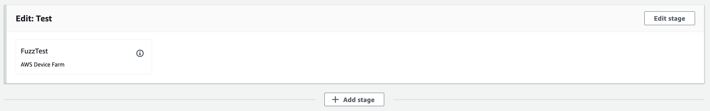
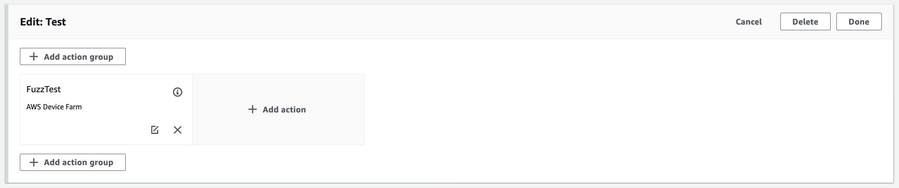
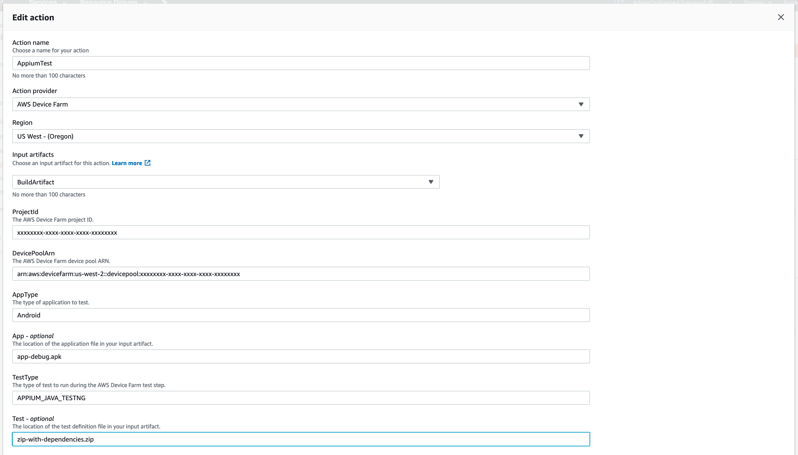

[Back to main guide](../README.md) 

[Previous](code-pipeline-test-built-in.md)

#### Add an Appium JavaNG test to your Code Pipeline

1. Open the CodePipeline [console page](https://us-west-2.console.aws.amazon.com/devicefarm/home?#/projects)
3. Click **aws-codepipeline-devicefarm** pipeline link
4. Click **Edit**
5. On the **Test** stage click **Edit**

6. On the **Test** stage click **Add action**:

7. Under **Edit action**:
  - For **Action name**, specify `AppiumTest`
  - For **Action provider**, choose `AWS Device Farm`
  - For **Input artifacts**, choose `BuildArtifact`
  - For **ProjectId**, specify the output from the 2nd command above
  - For **DevicePoolArn**, specify the output from the 3rd command above
  - For **AppType**, specify `Android`
  - For **App**, specify `app-debug.apk`
  - For **TestType**, specify `APPIUM_JAVA_TESTNG`  
  - For **Test**, specify `zip-with-dependencies.zip`

  - Click **Done**
  - Click **Save**
  - Click **Save**

9. To run the pipeline click **Release Change**  
  - Then click **Release**

[Previous](code-pipeline-test-built-in.md)