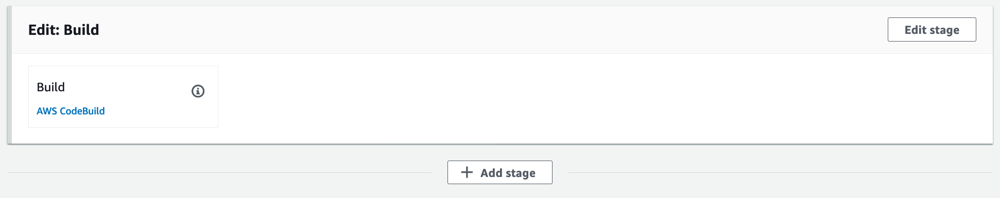
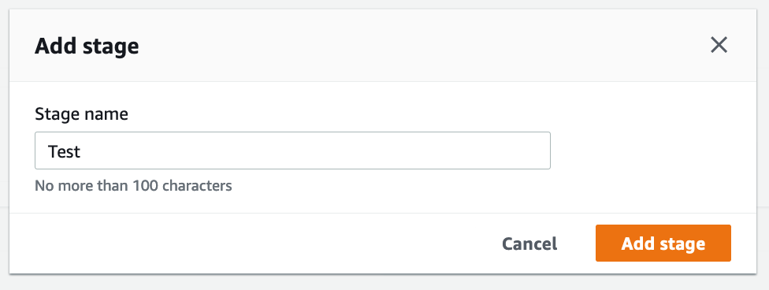
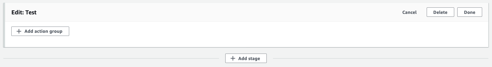
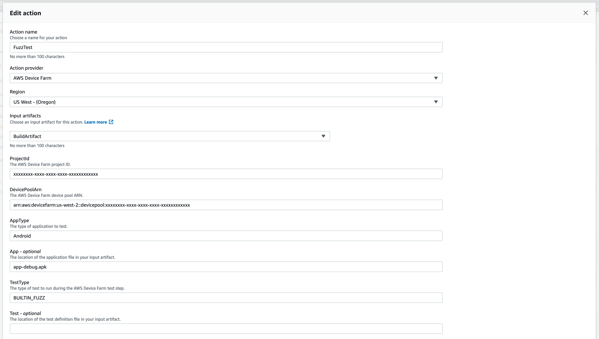
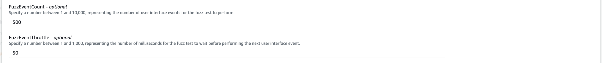

[Back to main guide](../README.md) 

[Previous](device-farm.md) | [Next](code-pipeline-test-appium.md)

#### Add a Test stage and Built In test to your Code Pipeline

1. Get your AWS Device Farm project ARN
```bash
PROJECT_ARN=$(aws devicefarm list-projects | jq -r '.projects[] | select(.name=="aws-codepipeline-devicefarm") | .arn')
echo $PROJECT_ARN | sed -e 's/^.*://g'
aws devicefarm list-device-pools --arn $PROJECT_ARN | jq -r '.devicePools[] | select(.name=="Top Devices") | .arn'
```

2. Open the CodePipeline [console page](https://us-west-2.console.aws.amazon.com/devicefarm/home?#/projects)
3. Click **aws-codepipeline-devicefarm** pipeline link
4. Click **Edit**
5. Below the **Build** stage click **Add stage**



6. Under **Add Stage**:
  - For **Stage name**, specify `Test`
  - Click **Add Stage**



7.  In the **Test** stage click **Add action group**



8. Under **Edit action**:
  - For **Action name**, specify `FuzzTest`
  - For **Action provider**, choose `AWS Device Farm`
  - For **Input artifacts**, choose `BuildArtifact`
  - For **ProjectId**, specify the output from the 2nd command above
  - For **DevicePoolArn**, specify the output from the 3rd command above
  - For **AppType**, specify `Android`
  - For **App**, specify `app-debug.apk`
  - For **TestType**, specify `BUILTIN_FUZZ`  



  - For **FuzzEventCount**, specify `500`
  - For **FuzzEventThrottle**, specify `50`




  - Click **Done**
  - Click **Save**
  - Click **Save**

9. To run the pipeline click **Release Change**  
  - Then click **Release**

[Previous](device-farm.md) | [Next](code-pipeline-test-appium.md)