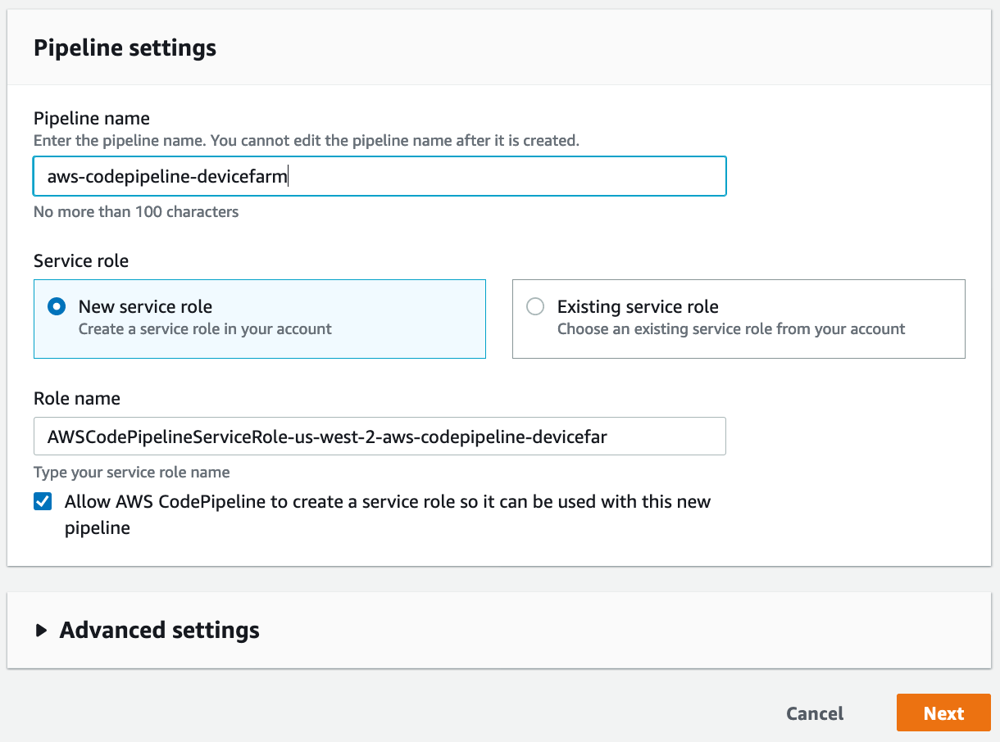
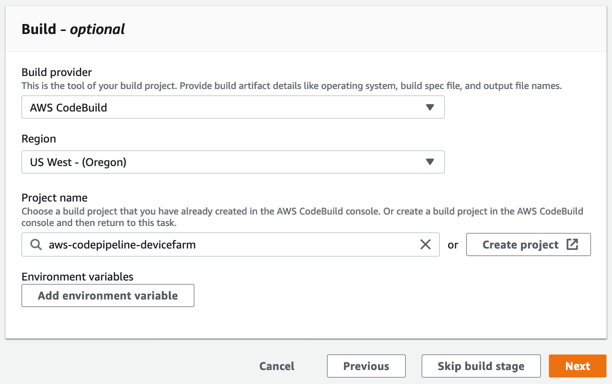
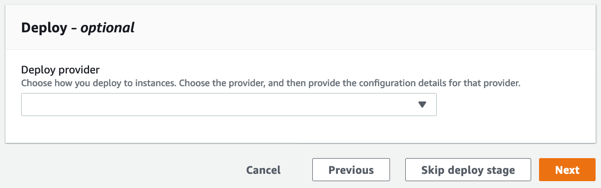
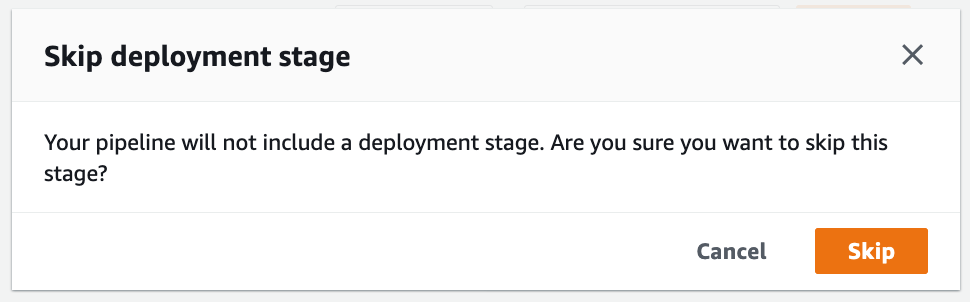

[Back to main guide](../README.md) 

[Previous](code-build.md) | [Next](device-farm.md)

#### Create a CodePipeline pipeline

1. Open the CodePipeline [console page](https://us-west-2.console.aws.amazon.com/codesuite/codepipeline/pipelines?region=us-west-2)
2. Click **Create pipeline**
3. Under **Choose pipeline settings**:
  - For **Pipeline name**, specify `aws-codepipeline-devicefarm`
  - For **Service role**, choose `New service role`
  - For **Role name** accept the generated name
  - Ensure **Allow AWS CodePipeline to create a service role so it can be used with this new pipeline** is checked
  - Click **Next**

4. Under **Source**:
  - For **Source provide**, choose `AWS CodeCommit`
  - For **Repository name**, choose `aws-codepipeline-devicefarm`
  - For **Branch name**, choose `master`
  - For **Change detection options**, choose `Amazon CloudWatch Events`
  - Click **Next**

5. Under **Build**:
  - For **Build provider**, choose `AWS CodeBuild`
  - For **Project name**, choose `aws-codepipeline-devicefarm`
  - Click **Next**

6. Under **Deploy**:
  - Click **Skip deploy stage**

6. Under **Skip deployment stage**:
  - Click **Skip**

7. Under **Review**:
  - Click **Create Pipeline**

[Previous](code-build.md) | [Next](device-farm.md)