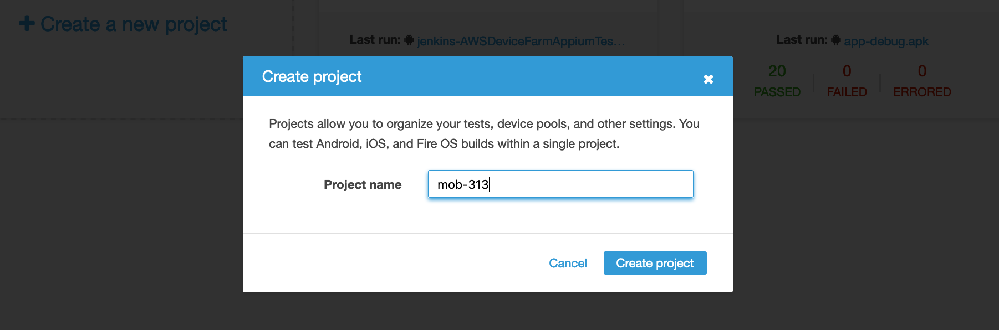

[Back to main guide](../README.md) 

[Previous](code-pipeline.md) | [Next](code-pipeline-test-built-in.md)

#### Create a Device Farm project

1. Open the CodePipeline [console page](https://us-west-2.console.aws.amazon.com/devicefarm/home?#/projects)
2. Click **Create a new project**
  - For **Project name**, choose `aws-codepipeline-devicefarm`

[Previous](code-pipeline.md) | [Next](code-pipeline-test-built-in.md)